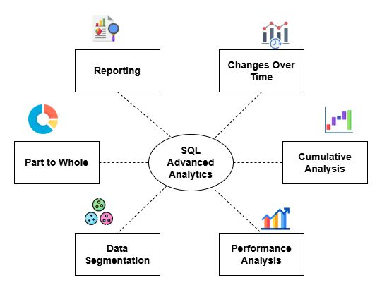

# 📊 Advanced SQL Analytics Project

## Overview
This repository contains advanced analytical SQL queries and Gold-layer views designed to extract business insights from a Data Warehouse.  
The focus is on **time-based trends, cumulative analysis, segmentation, performance evaluation, and reporting**.

All queries are implemented in **T-SQL** and are analytics-ready for reporting and BI integration.

---

## 🔍 Analyses Included

### 1. Changes Over Time
- Monthly and yearly sales aggregation  
- Trend detection using chronological grouping  
- Key metrics: total sales, total quantity, and unique customers  

### 2. Cumulative Analysis
- Running totals of sales over time  
- Monthly aggregation with cumulative sum  
- Tracks growth and momentum for decision-making  

### 3. Data Segmentation
- Product cost segmentation: Below 100, 100–500, 500–1000, Above 1000  
- Customer spending segmentation: VIP, Regular, New  
- Supports targeted marketing and pricing strategies  

### 4. Part-to-Whole Analysis
- Category-level revenue contribution  
- Percentage share of total sales  
- Identifies top-performing categories and revenue distribution  

### 5. Performance Analysis
- Year-over-Year product performance comparison  
- Actual vs average sales for each product  
- Trend direction: Increasing, Decreasing, No Change  
- KPI benchmarking at product level  

### 6. Customers Report
- Analytics-ready view `gold.customers_report`  
- KPIs: total orders, total sales, total quantity, distinct products  
- Customer segmentation, age group, recency, average order value, monthly spend  

### 7. Products Report
- Analytics-ready view `gold.products_report`  
- KPIs: total sales, total quantity, total orders, total customers  
- Product lifespan, recency, performance segment  
- Average selling price, average order revenue, average monthly revenue  

---

## 🛠️ Technologies Used
- **SQL Server (T-SQL)**  
- **CTEs & Window Functions**  
- **Analytical Functions**: `SUM OVER`, `AVG OVER`, `LAG`, `DATEDIFF`  
- **Gold-Layer Views** for analytics and reporting  

---

## 🎯 Purpose
This project demonstrates the ability to:
- Perform advanced SQL analytics  
- Extract actionable insights from a Data Warehouse  
- Build reusable analytics views for customers and products  
- Support business decision-making with performance metrics  

---

## ☕ Stay Connected

Feel free to connect with me — I’d love to stay in touch!

👉 **LinkedIn:** https://www.linkedin.com/in/mohammad-abo-al-rub-057a51243/

---

## 🛡️ License

This project is licensed under the **MIT License**.  
You are free to use, modify, and share this project with proper attribution.

---

## 🌟 About Me

Hi! I'm Mohammad Abu Alrub — a data lover who enjoys turning messy data into something clear, useful, and impactful.
I like creating hands-on projects that reflect how I think, learn, and solve problems.
Every project I build helps me grow as an analyst and share what I learn with others.

Let’s connect on LinkedIn!  
👉 **https://www.linkedin.com/in/mohammad-abo-al-rub-057a51243/**

